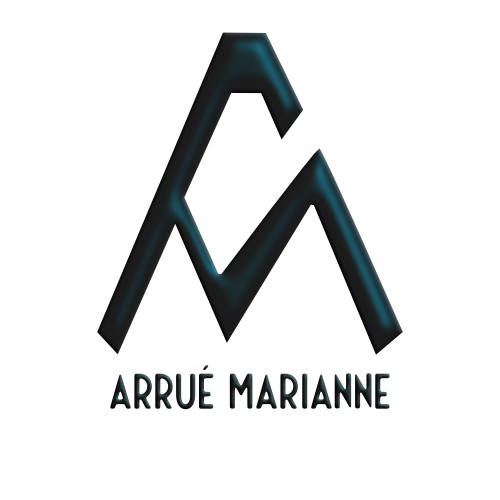

  
  

  
    
  
  

  

---

### :woman_technologist: About Me :

- 🔭 Software Engineer | AI & ML Enthusiast
- 🎓 Graduated from Holberton School Toulouse
- 🌱 Specialist Year in Artificial Intelligence and Machine Learning
- 💼 Former Biotechnology Engineer & Scientific Facilitator
- 🤔 I love simplifying complex concepts for my peers
- 💬 Always learning and refreshing my knowledge

- 🌍  I'm based in Toulouse
- 📫 Reach me: marianne.arrue@holbertonstudents.com

---
### :heart: My Hobbies:
- 🎼 Music: I play dubble bass in a Big Band (I'm the co-fondator of the band) ans tenor saxophon in a quartet group.
- 🧁 Food: I love making high-precision pastry
- 📷 Photography: I love seize THE moment

---

### :hammer_and_wrench: Tech Stack :

  &nbsp;
   &nbsp;
  &nbsp;
   &nbsp;
  &nbsp;

   &nbsp;
   &nbsp;
     &nbsp;
     &nbsp;
     &nbsp;
     &nbsp;
     &nbsp;
      &nbsp;
      &nbsp;
          &nbsp;

     &nbsp;
     &nbsp;
     &nbsp;
     &nbsp;
     &nbsp;
     &nbsp;

     &nbsp;
  &nbsp;
  &nbsp;
   &nbsp;
  &nbsp;

---
### 🌟 Achievements:
- 🏆 Pitch Battle French Tech Summer 2023
- 📚 Published articles on AI & ML in medium, linkedin
- 🎵 Developed a private portfolio project: an application to substitute for an absent musician in a band for a concert
- 🚀 Member of the Zero To Mastery (ZTM) Member Academy
---

### :fire: My Stats :

  

  

  

    
  

